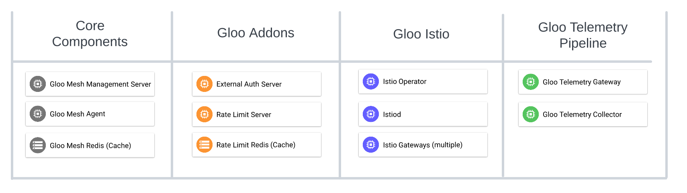

# Install Gloo Platform Components

Links:
* [Gloo Platform Setup Docs](https://docs.solo.io/gloo-mesh-enterprise/latest/setup/)
* [Gloo Platform Production Docs](https://docs.solo.io/gloo-mesh-enterprise/latest/setup/prod/recommended_setup/)
* [Relay Architecture](https://docs.solo.io/gloo-mesh-enterprise/main/concepts/platform/relay/)

## Architecture

At its core, Gloo Platform is a simple deployment of a mangement server and an agent on each remote cluster. Optionally you can deploy "Addon" features like external authorization, rate limiting, and managed istio. This workshop will utilize these addons to highlight the features they provide on top of Gloo Platform.



## Setup

Please set these environment variable and load the helm charts, they will be used throughout the rest of the workshop.

* Environment Variables
```sh
export GLOO_PLATFORM_LICENSE_KEY=<licence_key>
export GLOO_PLATFORM_VERSION=v2.2.6
export ISTIO_REVISION=1-16
```

1. Add helm repos
```sh
helm repo add gloo-mesh-enterprise https://storage.googleapis.com/gloo-mesh-enterprise/gloo-mesh-enterprise
helm repo add gloo-mesh-agent https://storage.googleapis.com/gloo-mesh-enterprise/gloo-mesh-agent
helm repo add istio https://istio-release.storage.googleapis.com/charts
helm repo update
```


2. Install `meshctl`, the Gloo Platform CLI.
```
curl -sL https://run.solo.io/meshctl/install | GLOO_MESH_VERSION=${GLOO_PLATFORM_VERSION} sh -
export PATH=$HOME/.gloo-mesh/bin:$PATH

meshctl version
```

## Install/Configure Management Plane

1. Install Gloo Platform in your cluster. This command creates a gloo-mesh namespace and installs the management plane components, such as the management server and Prometheus server. 
```sh
# helm show values gloo-mesh-enterprise/gloo-mesh-enterprise --version $GLOO_PLATFORM_VERSION > gloo-mesh/mgmt-server-values.yaml
helm upgrade --install gloo-platform gloo-mesh-enterprise/gloo-mesh-enterprise \
  --version=$GLOO_PLATFORM_VERSION \
  --namespace gloo-mesh \
  --set global.cluster=gloo \
  --create-namespace \
  --set glooMeshLicenseKey=$GLOO_PLATFORM_LICENSE_KEY \
  --set glooTrialLicenseKey=$GLOO_PLATFORM_LICENSE_KEY \
  --set glooGatewayLicenseKey=$GLOO_PLATFORM_LICENSE_KEY
```
3. Before an agent can be connected, it needs to be registered with the management plane. Create the following object to register the Gloo Agent we are about to install and connect. 
```yaml
kubectl apply -f- <<EOF
apiVersion: admin.gloo.solo.io/v2
kind: KubernetesCluster
metadata:
  name: gloo
  namespace: gloo-mesh
spec:
  clusterDomain: cluster.local
EOF
```

## Install/Configure Gloo Agent

By simply installing the Gloo Platform Agent you gain the ability to manage it with Gloo Platform. By default, the Gloo Agent is non invasive and simply relays service discovery information to the Management Plane. 

1. Install Gloo Mesh Agent
```sh
# helm show values gloo-mesh-agent/gloo-mesh-agent --version $GLOO_PLATFORM_VERSION > gloo-mesh/agent-values.yaml
helm upgrade --install gloo-agent gloo-mesh-agent/gloo-mesh-agent \
  --version=$GLOO_PLATFORM_VERSION \
  --namespace gloo-mesh \
  --set relay.serverAddress=gloo-mesh-mgmt-server.gloo-mesh:9900 \
  --set cluster=gloo
```

3. Validate installation using `meshctl`
```sh
meshctl check
```

4. Open the Gloo Platform UI
```sh
meshctl dashboard
```