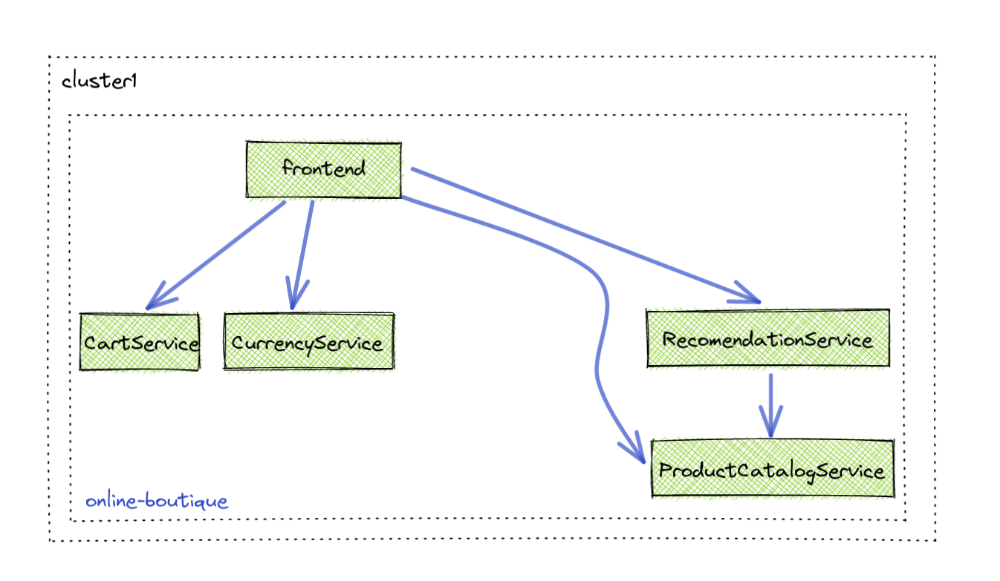

# Deploy Online Boutique

The Online Boutique applicaion is a set of microservices that make up an online shopping website. There is a UI application that reaches out to many APIs to retrieve its data to populate the UI. This workshop will incrementally add features to this website in the coming labs. 



1. Create and label namespace for Istio injection
```sh
kubectl create namespace online-boutique
```

2. Deploy online boutique
```sh
kubectl apply -n online-boutique -f 03-deploy-online-boutique/app/
```

3. Verify Installation
```sh
kubectl get pods -n online-boutique
```