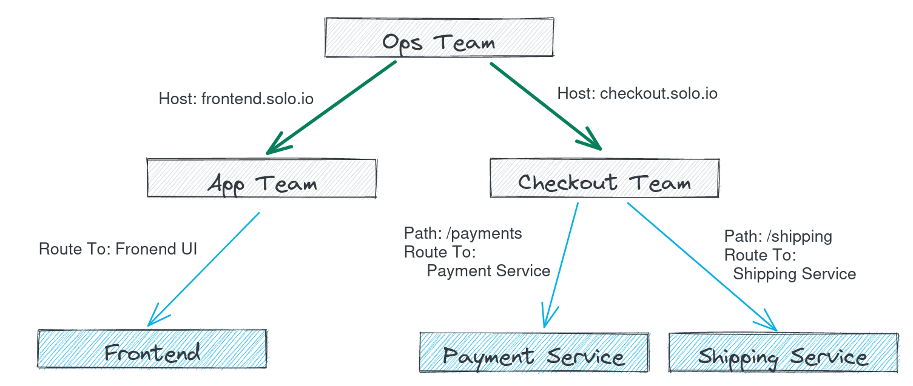
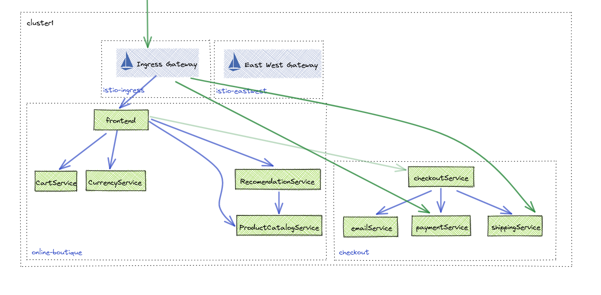

# Multi Tenancy

Gloo Platform allows for multiple teams to share the routing decisions without impacting each other. With Workspaces, teams can manage routes specific to their domain without impacting the rest of routes passing through the Gloo Gateway. To effectively manage all routes through a centralized gateway, Gloo platform allows you to delegate domains or paths to teams responsible for those routes.

## Route Delegation

In this workshop you will be adding the checkout APIs that the `Checkout Team` has implemented. Not only will this be used by the Online Boutique application, your business has asked you to expose your APIs through the Gloo Gateway. The Ops team has assigned the Checkout Team APIs a host of `checkout.solo.io` and delgated routing decisions to them.



1. Deploy the checkout APIs
```sh
kubectl create namespace checkout
kubectl label namespace checkout istio.io/rev=$ISTIO_REVISION
kubectl apply -n checkout -f 07-multi-tenancy/checkout-apis.yaml
```


2. Onboard the Checkout Team to the Gloo Platform
```sh
kubectl apply -f 07-multi-tenancy/checkout-team-workspace.yaml
```

3. Allow Ops team to discover the checkout team services to allow routing to the apis
```sh
kubectl apply -f 07-multi-tenancy/ops-team-workspace-settings.yaml
```

4. Ops Team -- Delegate routing for `checkout.solo.io` to the checkout team
```sh
kubectl apply -f 07-multi-tenancy/ops-team-checkout-route-table.yaml
```

5. Checkout Team -- Route /payments  and /shipping to their respective routes
```sh
kubectl apply -f 07-multi-tenancy/checkout-team-payments-route-table.yaml
```



6. Test that the routing works for shipping

```sh
curl -k -X POST -H "Host: checkout.solo.io" https://$GLOO_GATEWAY_HTTPS/shipping/quote --data-binary @- << EOF
{
    "address": {
        "city": "Cambridge",
        "country": "USA",
        "state": "Massachusetts",
        "street_address": "222 Third Street #3300",
        "zip_code": 21421266
    },
    "items": [
        {
            "quantity": 2,
            "product_id": "OLJCESPC7Z"
        }
    ]
}
EOF
```

Expected Response
```json
{
 "costUsd": {
  "currencyCode": "USD",
  "units": "8",
  "nanos": 990000000
 }
}
```


7. Test that the routing works for Payments

```sh
curl -k -X POST -H "Host: checkout.solo.io" https://$GLOO_GATEWAY_HTTPS/payment/charge --data-binary @- << EOF
{
    "amount": {
        "currency_code": "USD",
        "nanos": 0,
        "units": "20"
    },
    "credit_card": {
        "credit_card_cvv": 123,
        "credit_card_expiration_month": 10,
        "credit_card_expiration_year": 2023,
        "credit_card_number": "4432-8015-6152-0454"
    }
}
EOF
```

Expected Response
```json
{
 "costUsd": {
  "currencyCode": "USD",
  "units": "8",
  "nanos": 990000000
 }
}
```

