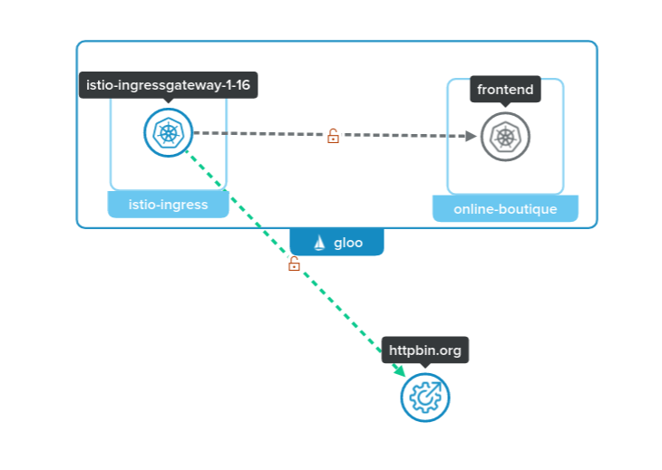
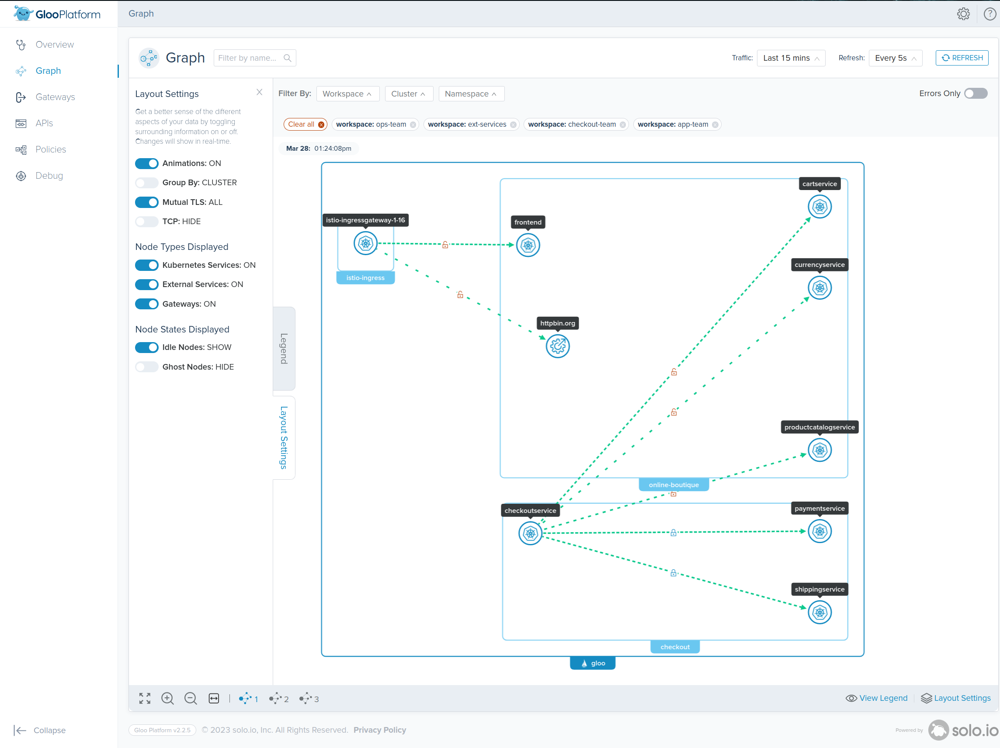

# External Service

Many times users will need to communicate with applications outiside of the service mesh. Gloo Platform represents these applications as `External Services`. By telling Gloo Platform about an External Service you are allowing that endpoint to be discovered and routable from applications running inside the service mesh. This concept becomes powerfull due to the ability to also apply Gloo Platform policies to it. For example in the below lab you will be securing the httpbin.org application with the JWT authentication in the previous lab. 



Links:
  - [External Service Doc](https://docs.solo.io/gloo-mesh-enterprise/latest/routing/forward-requests/external-service/)
  - [ExternalService API](https://docs.solo.io/gloo-mesh-enterprise/latest/reference/api/external_service/)

## Create Workspace for External Services

1. Create a Workspace for the external services
```sh
kubectl create namespace ext-services
kubectl apply -f 08-external-services/workspace.yaml
```

2. Import the services into the Ops team workspace
```sh
kubectl apply -f 08-external-services/ops-team-workspace-settings.yaml
```

3. Ops Team - Delegate host `ext-services.solo.io` for external services.
```sh
kubectl apply -f 08-external-services/ops-team-route-table.yaml
```

## Create an ExternalService

1. Create an ExternalService reference to the online httpbin application.
```sh
kubectl apply -n ext-services -f 08-external-services/external-service.yaml
```

2. Update the RouteTable to route to the ExternalService
```sh
kubectl apply -n ext-services -f 08-external-services/external-route-table.yaml
```

3. Call the external httpbin application through the Gloo Gateway
```sh
curl -k -H "Host: ext-services.solo.io" https://$GLOO_GATEWAY_HTTPS/httpbin/get
```

Expected Response
```json
{
  "args": {}, 
  "headers": {
    "Accept": "*/*", 
    "Host": "ext-services.solo.io", 
    "User-Agent": "curl/7.88.1", 
    "X-Amzn-Trace-Id": "Root=1-6423303e-6dfbdaf11e990c5642c8a78c", 
    "X-B3-Sampled": "0", 
    "X-B3-Spanid": "dc6cd93fe1c4bc96", 
    "X-B3-Traceid": "7bb484c4ddf95c60dc6cd93fe1c4bc96", 
    "X-Envoy-Attempt-Count": "1", 
    "X-Envoy-Decorator-Operation": "httpbin.org:443/httpbin*", 
    "X-Envoy-Internal": "true", 
    "X-Envoy-Original-Path": "/httpbin/get", 
    "X-Envoy-Peer-Metadata-Id": "router~10.42.0.21~istio-ingressgateway-1-16-558c55b6bc-qwj5q.istio-ingress~istio-ingress.svc.cluster.local"
  }, 
  "url": "https://ext-services.solo.io/get"
}
```

## View Gloo Platform Graph

1. Enable the Gloo Platform UI again 
```sh
meshctl dashboard
```

2. Click on 'Graph' to view the requests. In `Layout Settings` make sure `External Services: ON`. Remember to check ALL workspaces to view all the traffic.


