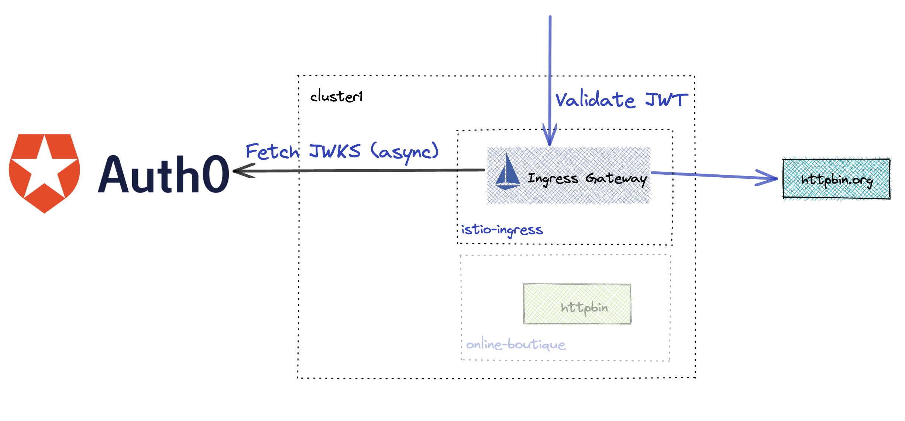

# JWT Policy

One way for users to authenticate themselves is via JSON Web Tokens or JWT for short. Gloo Platform can validate JWT tokens against an external JSON Web Key Set (JWKS). Below is a lab that validates JWT tokens generated from an external provider Auth0.



Links:
- [External Authorization Docs](https://docs.solo.io/gloo-mesh-enterprise/latest/policies/external-auth/)
- [JWTPolicy API](https://docs.solo.io/gloo-mesh-enterprise/latest/reference/api/jwt_policy/)

## Enforcing JWT Authentication


1. Enable JWT Authentication for the httpbin routes
```sh
kubectl apply -n ext-services -f 09-jwt/auth0-external-service.yaml
kubectl apply -n ext-services -f 09-jwt/jwt-policy.yaml
```

2. Call httpbin and get denied
```sh
curl -k -H "Host: ext-services.solo.io" https://$GLOO_GATEWAY_HTTPS/httpbin/get
```

Expected output
```txt
Jwt is missing
```

3. Generate JWT from Auth0 using the below command
```sh
ACCESS_TOKEN=$(curl -sS --request POST \
  --url https://dev-64ktibmv.us.auth0.com/oauth/token \
  --header 'content-type: application/json' \
  --data '{"client_id":"1QEVhZ2ERqZOpTQnHChK1TUSKRBduO72","client_secret":"J_vl_qgu0pvudTfGppm_PJcQjkgy-kmy5KRCQDj5XHZbo5eFtxmSbpmqYT5ITv2h","audience":"https://httpbin/api","grant_type":"client_credentials"}' | jq -r '.access_token')

printf "\n\n Access Token: $ACCESS_TOKEN\n"
```

4. Call httpbin using the Access token to authenticate
```sh
curl -vk -H "Authorization: Bearer $ACCESS_TOKEN" -H "Host: ext-services.solo.io" https://$GLOO_GATEWAY_HTTPS/httpbin/get
```