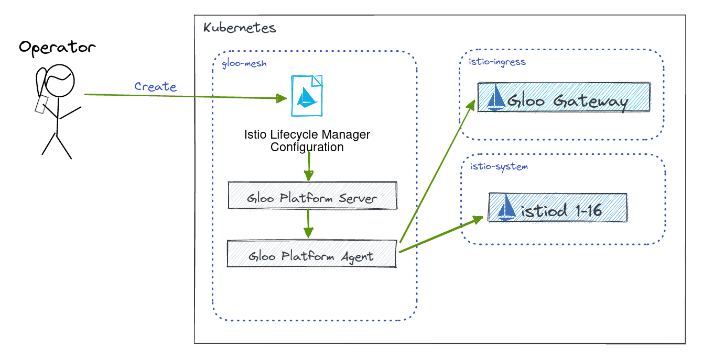

# Deploy Gloo Gateway with Gloo Platform



With a Gloo Platform-managed installation, you no longer need to use istioctl to individually install Istio in each workload cluster. Instead, you can supply Istio configurations in a IstioLifecycleManager resource to your management cluster. Gloo Platform translates this resource into Istio control planes, gateways, and related resources in your registered workload clusters for you.

Links:
- [Gloo Platform Managed Istio](https://docs.solo.io/gloo-mesh-enterprise/latest/setup/installation/istio/gm_managed_istio/)
- [GatewayLifecycleManager API](https://docs.solo.io/gloo-mesh-enterprise/latest/reference/api/gateway_lifecycle_manager/)
- [IstioLifecycleManager API](https://docs.solo.io/gloo-mesh-enterprise/latest/reference/api/istio_lifecycle_manager/)

1. Apply IstioLifecycleManager to management plane to deploy Istiod control plane.
```sh
kubectl apply -f 02-deploy-gloo-gateway/control-plane.yaml
```

2. Apply GatewayLifecycleManager to management plane to deploy Gloo gateway.
```sh
kubectl apply -f 02-deploy-gloo-gateway/gateway.yaml
```

3. Verify Installations on the cluster

```sh
kubectl get pods -n istio-system
kubectl get pods -n istio-ingress --no-headers
```