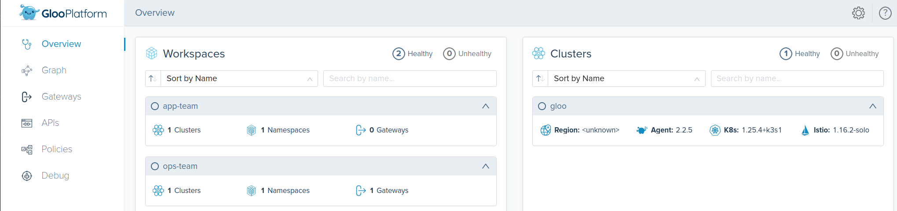
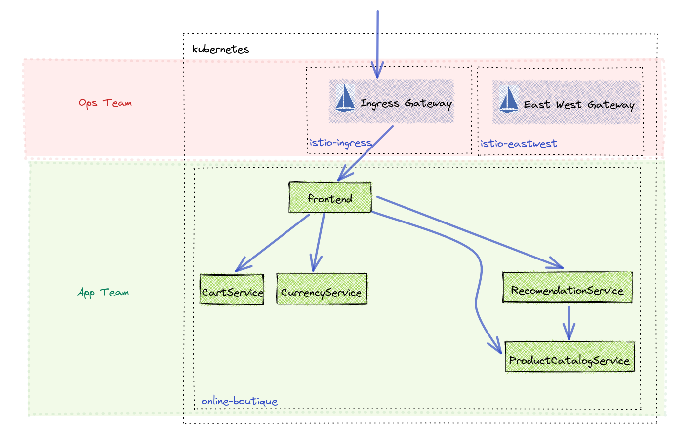
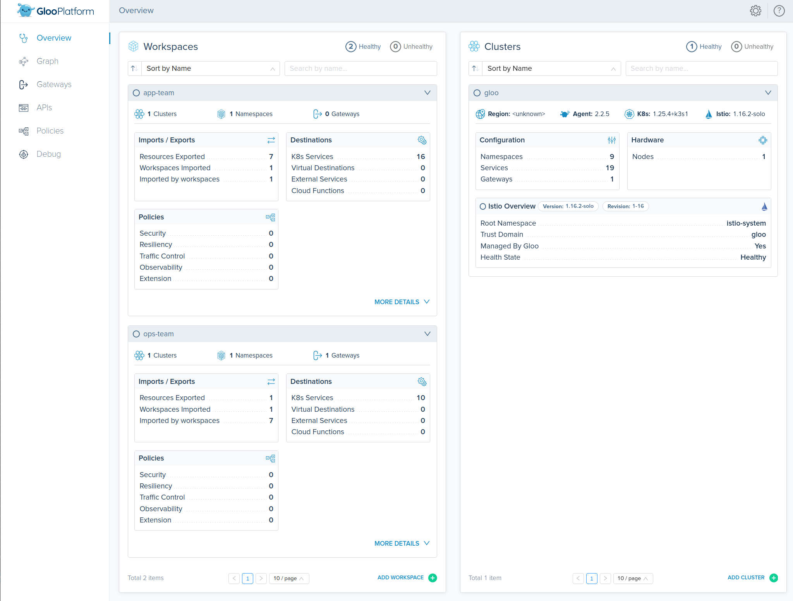
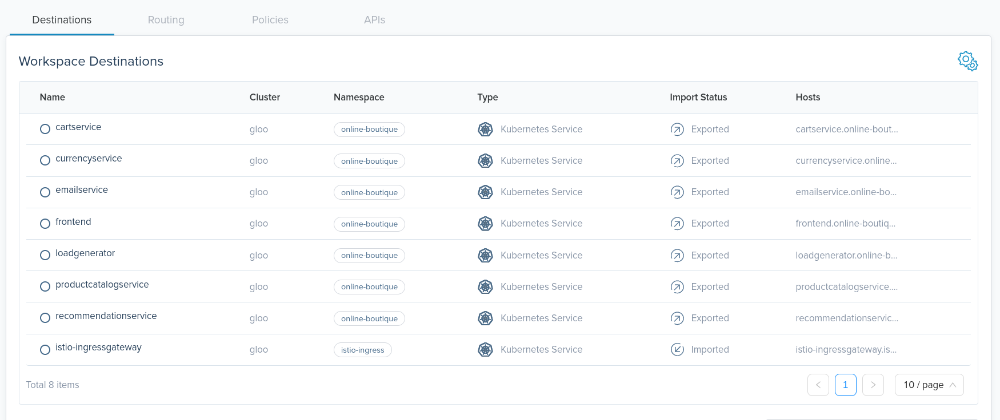

# Configure Gloo Platform


Links:
- [Gloo Platform Multi-Tenancy](https://docs.solo.io/gloo-mesh-enterprise/latest/concepts/multi-tenancy/)
- [Workspace API](https://docs.solo.io/gloo-mesh-enterprise/latest/reference/api/workspace/#workspacespec)
- [WorkspaceSettings API](https://docs.solo.io/gloo-mesh-enterprise/latest/reference/api/workspace_settings/)



## Setup Operations Team Workspace

1. Apply Gloo Platform configuration for ops-team
```sh
kubectl apply -f 04-configure-gloo-platform/ops-team.yaml
```

## Setup Application Team Workspace

1. Apply Gloo Platform configuration for app-team
```sh
kubectl apply -f 04-configure-gloo-platform/app-team.yaml
```

## View Service Discovery in Gloo Platform UI

1. Bring up dashboard
```sh
meshctl dashboard
```

2. View workspaces


3. View app-team service discovery
