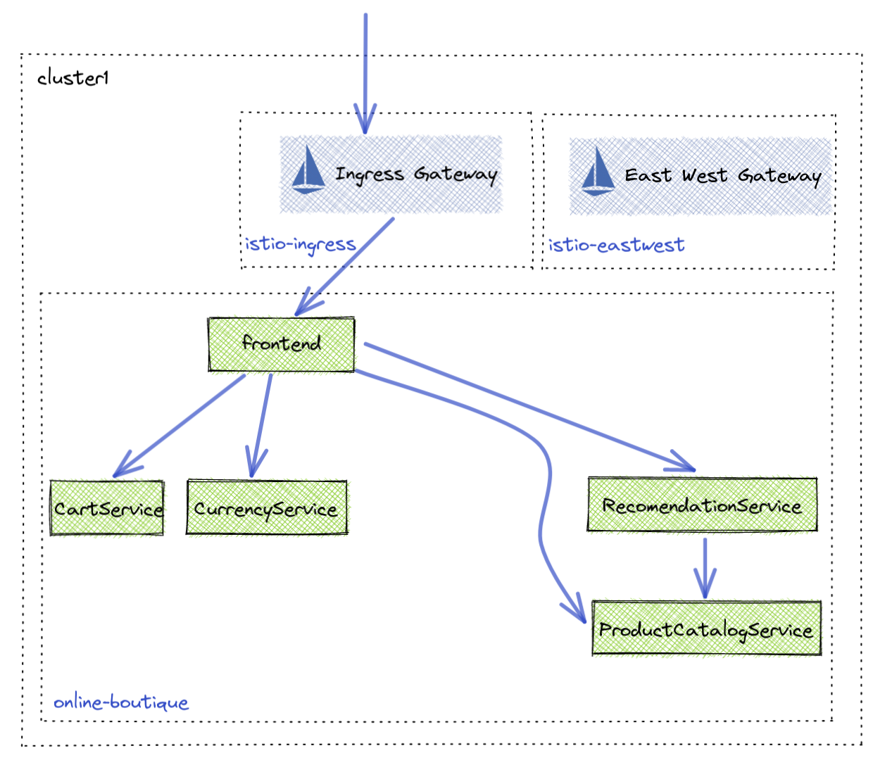

# Expose Online Boutique


Links:
- [Gloo Platform Routing](https://docs.solo.io/gloo-mesh-enterprise/latest/routing/)
- [VirtualGateway API](https://docs.solo.io/gloo-mesh-enterprise/latest/reference/api/virtual_gateway/)
- [RouteTable API](https://docs.solo.io/gloo-mesh-enterprise/latest/reference/api/route_table/)
- [Route Delegation](https://docs.solo.io/gloo-mesh-enterprise/latest/routing/rt-delegation/)



## Operations team gateway setup

The operations team is responsible for setting the ports and protocols of Gloo Gateway. In a later section they will also secure the gateway with TLS.

1. Configure Gloo Gateway ports and protocols using the Gloo `VirtualGateway` API. Delegate routing decisions to the application team
```sh
kubectl apply -n istio-ingress -f 05-ingress/virtual-gateway.yaml
```

2. Setup the highlest level route table owned by the operations team. Delegate routing decisions to the `app-team`
```sh
kubectl apply -n istio-ingress -f 05-ingress/ops-team-route-table.yaml
```

## Application Team Routing

Due to the Ops team delegating routing decisions to the App team, the App team now needs to configure where traffic should flow.

1. Configure a `RouteTable` object to route to online-boutique frontend
```sh
kubectl apply -n online-boutique -f 05-ingress/app-team-route-table.yaml
```

2. Access online-boutique
```sh
export GLOO_GATEWAY=$(kubectl -n istio-ingress get svc istio-ingressgateway -o jsonpath='{.status.loadBalancer.ingress[0].*}'):80

echo "Online Boutique available at http://$GLOO_GATEWAY"
```

## Secure Ingress with HTTPS

Most users need to secure traffic coming from outside their Kubernetes cluster. To do this you need to create a certificate that can be used by Gloo Gateway in the namespace the gateway resides. 

1. Create example certificate and upload to gloo gateway namespace
```sh
openssl req -x509 -nodes -days 365 -newkey rsa:2048 \
   -keyout tmp/tls.key -out tmp/tls.crt -subj "/CN=*"

kubectl -n istio-ingress create secret generic tls-secret \
--from-file=tls.key=tmp/tls.key \
--from-file=tls.crt=tmp/tls.crt
```

2. Using the `VirtualGateway` API we can update the current configuration to expose traffic on port 443 using TLS.
```sh
kubectl apply -n istio-ingress -f 05-ingress/virtual-gateway-https.yaml
```

3. Access online-boutique with HTTPS
```sh
export GLOO_GATEWAY_HTTPS=$(kubectl -n istio-ingress get svc istio-ingressgateway -o jsonpath='{.status.loadBalancer.ingress[0].*}'):443

echo "SECURE Online Boutique available at https://$GLOO_GATEWAY_HTTPS"
```

4. Optional curl
```sh
curl -vk https://$GLOO_GATEWAY_HTTPS
```
