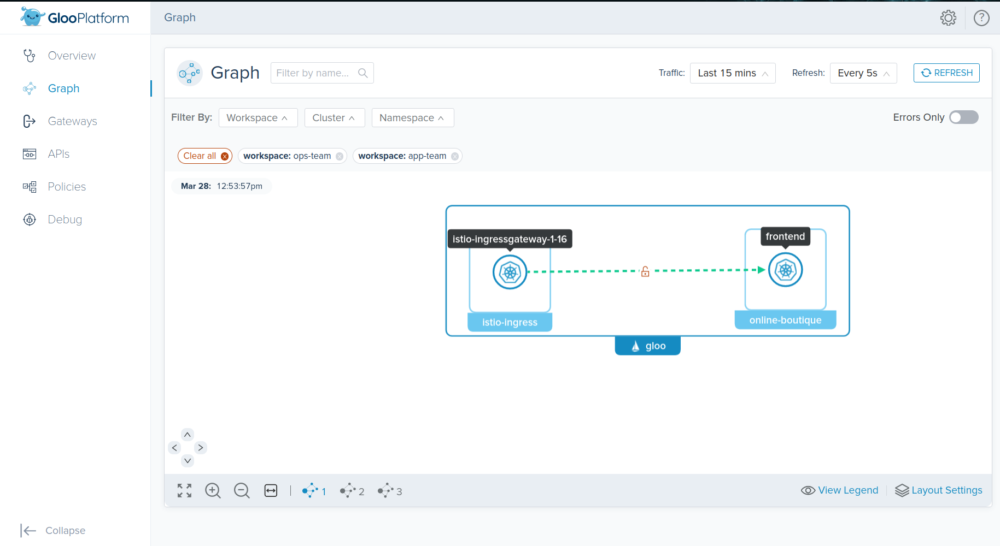
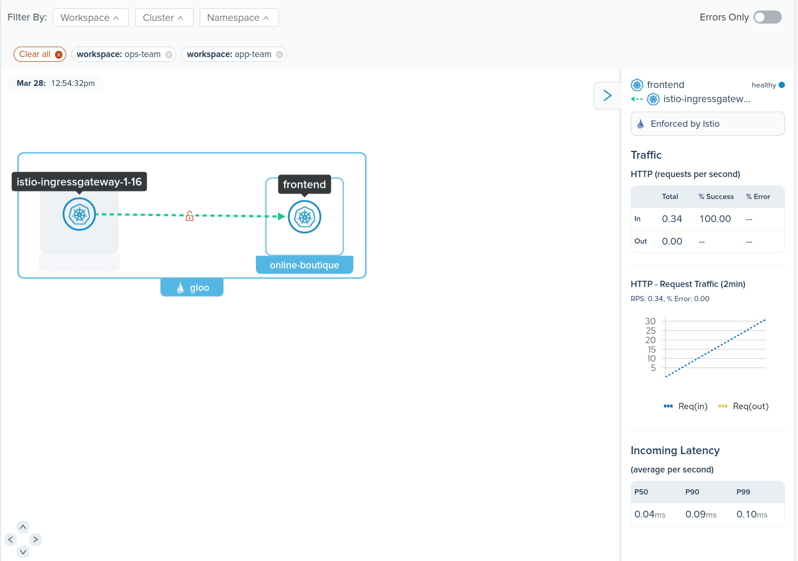
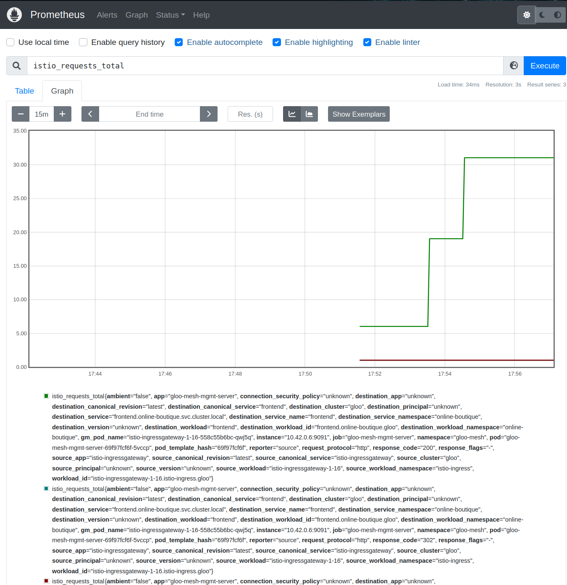

# Observability



## Gloo Mesh UI

1. Navigate to Gloo Mesh `Graph` on the left hand side of the dashboard.

```sh
meshctl dashboard
```

2. Select both Workspaces in the dropdown list to view all the services


3. View the traffic between the services. You may need to generate some more traffic if applications are not showing




## Metrics

To view the metrics generated by Gloo Platform in prometheus run the following command. 
```sh
kubectl port-forward svc/prometheus-server -n gloo-mesh 9080:80
```
Navigate to the graph page and search for the metric `istio_requests_total`




These metrics are scraped from the gloo-mesh-mgmt-server. Gloo Platform combines metrics from all clusters and makes it available from a single place.

To view the raw metrics you can run
```sh
kubectl port-forward deploy/gloo-mesh-mgmt-server -n gloo-mesh 9091:9091
```

Grab the metrics
```
curl localhost:9091/metrics
```

## Why can't I see the other services?

Only the Gloo Gateway (istio-ingressgateway) is currently reporting request metrics. To see more of the call stack you will need to enable service mesh on your applications. 