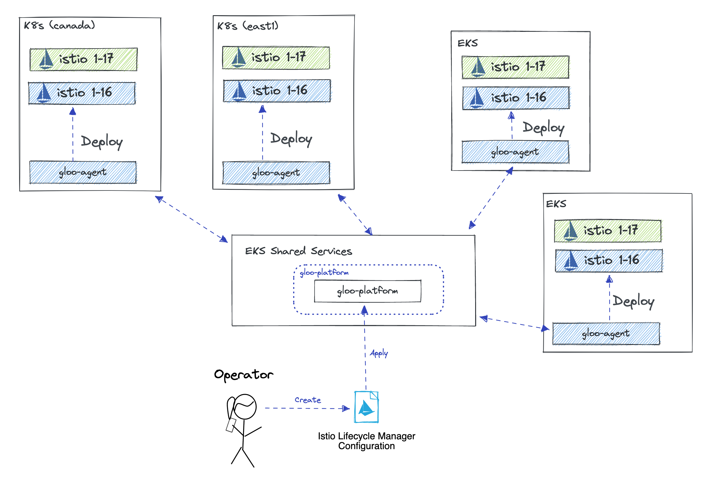

# Zero Downtime Istio Upgrade



Historically, upgrading Istio without downtime has been a complicated ordeal. Today, Gloo Platform can easily facilitate zero downtime upgrades using its Istio Lifecycle Manager. Gloo Platform allows you to deploy multiple versions if Istio side-by-side and transition from one version to the other. 

Links:
- [Gloo Platform Managed Istio](https://docs.solo.io/gloo-mesh-enterprise/latest/setup/installation/istio/gm_managed_istio/)
- [GatewayLifecycleManager API](https://docs.solo.io/gloo-mesh-enterprise/latest/reference/api/gateway_lifecycle_manager/)
- [IstioLifecycleManager API](https://docs.solo.io/gloo-mesh-enterprise/latest/reference/api/istio_lifecycle_manager/)

1. First you need to deploy the new version of istio alongside the existing one. To do that, update the existing `IstioLifecycleManager` API to include the new version.
```sh
kubectl apply -f 12-zero-downtime-upgrade-gloo-gateway/control-plane.yaml
```

2. Similarly, create a new 1-17 Istio eastwest gateway in the existing `GatewayLifecycleManager` API. Additionaly we will update the routing of requests bound for the load balanced service to the new eastwest gateway by changing the `activeGateway: true` on the new gateway and disable it for the old.
```sh
kubectl apply -f 12-zero-downtime-upgrade-gloo-gateway/gateway.yaml
```

3. Verify Traffic is still flowing