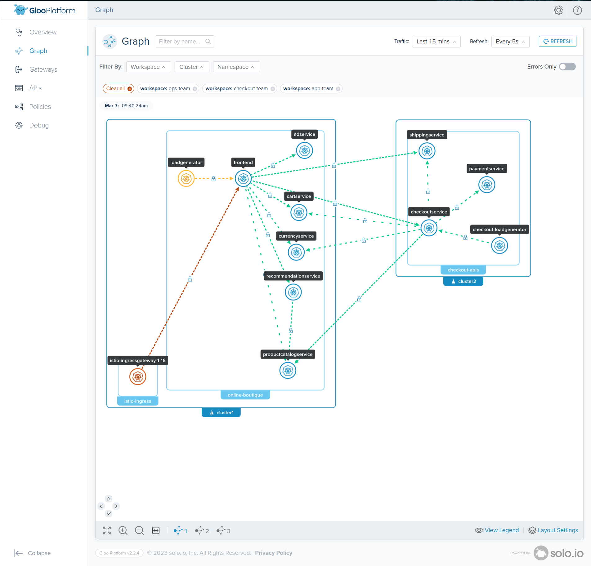
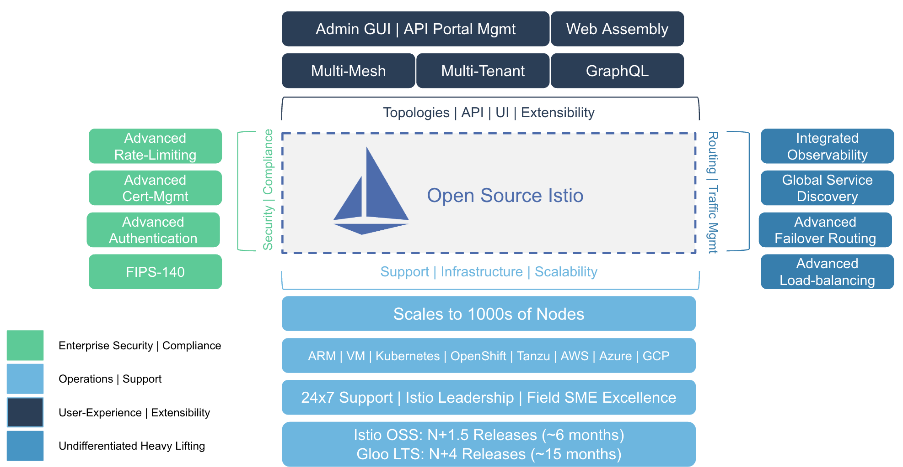

# <center>Gloo Platform Single Cluster POC</center>



[Gloo Platform](https://www.solo.io/products/gloo-mesh/) simplifies the adoption of a service mesh across single or many clusters. It is Enterprise [Istio](https://istio.io) with production support, N-4 support, CVE patching, FIPS builds, and a multi-cluster operational management plane to simplify running a service mesh across multiple clusters or a hybrid deployment. 

Gloo Platform also has features around multi-tenancy, global failover and routing, observability, and east-west rate limiting and policy enforcement (through AuthZ/AuthN plugins). 



## Setup

* Clone this repo
```sh
git clone git@github.com:solo-io/pnc-pov.git
```
